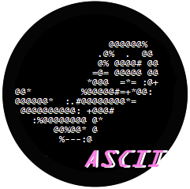

<!-- PROJECT LOGO -->
 

  

<h3 align="center">Steascii</h3>

  

    Small project to replace normal spaces with non-breaking spaces
     
    <a href="https://github.com/GuilhermeTorq/steascii/issues">Report Bug</a>
    ·
    <a href="https://github.com/GuilhermeTorq/steascii/issues">Request Feature</a>
  

<!-- TABLE OF CONTENTS -->

  
Table of Contents

  <ol>
    <li>
      <a href="#about-the-project">About The Project</a>
      <ul>
        <li><a href="#built-with">Built With</a></li>
      </ul>
    </li>
    <li>
      <a href="#getting-started">Getting Started</a>
      <ul>
        <li><a href="#installation">Installation</a></li>
      </ul>
    </li>
    <li><a href="#usage">Usage</a></li>
    <li><a href="#acknowledgments">Acknowledgments</a></li>
  </ol>

<!-- ABOUT THE PROJECT -->
## About The Project

This programme simply reads everything inside a txt file, looks for spaces and then replaces them with a non-breaking space.
It's very helpful with big ascii art for steam, when you need a "&nbsp" this does it automatically for you.
 
You don't need to worry about newlines as the code automatically detects it.
 
 
If you want to add ascii to your steam account, check the small guide bellow >>

### Built With

* [Python](https://python.org/)

<!-- GETTING STARTED -->
## Getting Started

To get a local copy up and running follow these simple example steps.

### Installation

If you choose to use the .py file
* python
  * [Official Website](https://www.python.org/)
  * Microsoft Store

If you choose to use the .exe file
* No need to install anything, just run the program

<!-- USAGE EXAMPLES -->
## Usage

Simple guide on how to make ascii art, for more detail check this one out: [How to Make ASCII Art for the Custom Info Box on Your Steam Profile Page](https://steamcommunity.com/sharedfiles/filedetails/?id=2235568594)

To turn an image to ascii you will need the free software [Ascii Generator 2](https://ascgendotnet.jmsoftware.co.uk/).
Just run the program and drag and drop the image on top of it.
You can change the width and height on the option "size" in the top left corner. I also recommend messing around with the contrast and brightness or invert everything from white to black.

After, just highlight  all the ascii and copy it and save it in a txt file. 
Run Steascii and select that file, copy the result and open this website [Dencode](https://dencode.com/en/string/character-width). Paste the ascii and select "Full Width", copy the result.

Open Wordpad or Word, paste the ascii and change the font to "Courier New" and font size to 10, also change the margins to the value of '1'. (This only serves the purpose to show you how it looks at the moment, but due to the width you had, it may look weird, but it's fine)

Alternatively you can just paste it in the notepad.

Now just copy it and use it wherever you want :)

<!-- video here --!>

<!-- ACKNOWLEDGMENTS -->
## Acknowledgments

* [Best-README-Template](https://github.com/othneildrew/Best-README-Template)
* [How to Make ASCII Art for the Custom Info Box on Your Steam Profile Page](https://steamcommunity.com/sharedfiles/filedetails/?id=2235568594)

(<a href="#top">back to top</a>)

